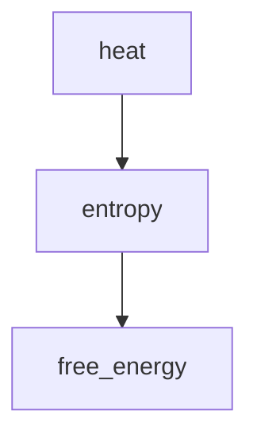

# Thermodynamics

Thermodynamics studies heat, work, entropy, and free energy in chemical systems.

## Core equation

$$\Delta G = \Delta H - T\Delta S$$

See [[content/equations/gibbs-free-energy]] and [[content/people/josiah-willard-gibbs]].
